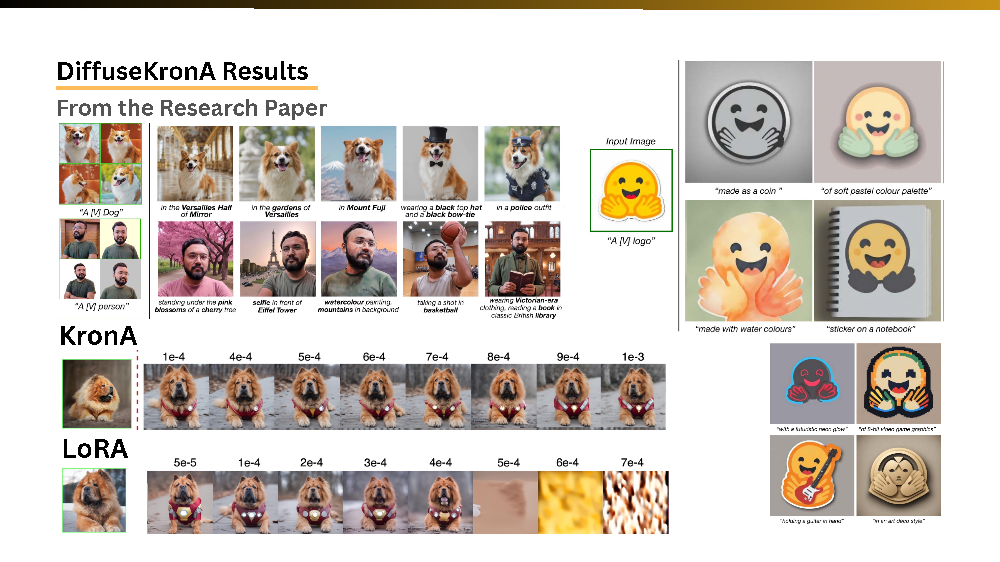
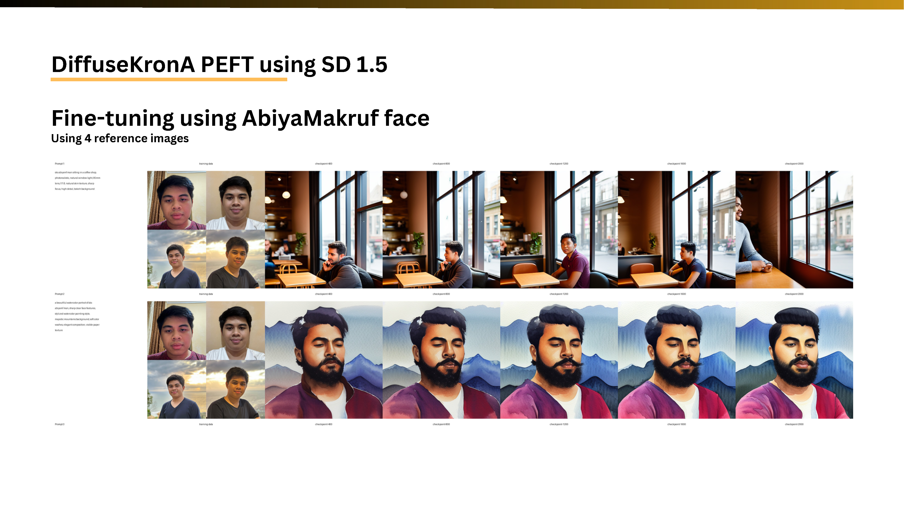
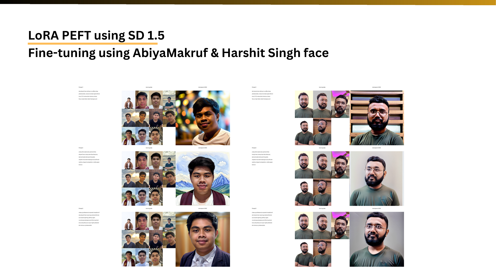

# Final Project Report: DiffuseKronA and DreamBooth LoRA for Personalized Text-to-Image Generation

This repository documents and reproduces experiments on parameter-efficient fine-tuning (PEFT) for personalized diffusion models. The main comparison is between LoRA (Low-Rank Adaptation) and KronA/DiffuseKronA-style Kronecker adapters for adapting Stable Diffusion models to custom identities, objects, and logos using only a small set of reference images.

The project material is based on the final presentation in [Readme_Asset/slide_presentation.pdf](Readme_Asset/slide_presentation.pdf), with implementation work split across two codebases:

- [DiffuseKronA](DiffuseKronA/): an IBM DiffuseKronA-based codebase for DreamBooth-style KronA fine-tuning and inference on Stable Diffusion / Stable Diffusion XL.
- [HuggingFace_Diffuser](HuggingFace_Diffuser/): a local Hugging Face Diffusers fork used for baseline DreamBooth LoRA experiments and a notebook-based LoRA vs KronA/LoKr comparison workflow.
- [Readme_Asset/Example_Image](Readme_Asset/Example_Image/): selected inference outputs and comparison slides used as the gallery in this report.

## Project Motivation

Text-to-image diffusion models can generate high-quality images from natural-language prompts, but base models are not personalized to a specific person, product, logo, or object. Fine-tuning is used to teach the model a new subject identity, usually by introducing a unique trigger token such as `sks` and a small reference image set.

Full fine-tuning updates all model weights. For modern diffusion models with very large parameter counts, this is expensive because training requires not only model weights but also gradients and optimizer states. The presentation highlights that full fine-tuning can cause heavy computation, high memory usage, and slow iteration.

PEFT reduces this cost by freezing most pretrained weights and training only a small adapter. This project focuses on two PEFT families:

- **LoRA** learns a low-rank update. It is efficient and widely supported, but the rank bottleneck can limit representation capacity, which may lead to identity drift or weaker multi-subject fidelity.
- **KronA / DiffuseKronA** uses Kronecker-product structured adapters. The Kronecker formulation can model pairwise structured interactions while keeping trainable parameters compressed, giving more controllable capacity than a single LoRA rank.

## Method Summary

### LoRA

LoRA freezes the pretrained model weight `W` and learns a low-rank residual update through two smaller matrices. This makes DreamBooth-style personalization more practical because only adapter parameters are trained and saved. In this repository, LoRA is used as the baseline through Hugging Face Diffusers' official DreamBooth LoRA training script.

Important LoRA observations from the presentation:

- It is parameter-efficient and easy to run with Diffusers.
- It can work well for identity locking when the dataset is clean.
- It is sensitive to learning rate, prompt format, image crop quality, and reference-image count.
- The low-rank bottleneck can limit complex identity or multi-subject learning.

### KronA and DiffuseKronA

KronA replaces the simple low-rank update with a Kronecker-product parameterization. DiffuseKronA applies this idea to personalized diffusion models by fine-tuning attention-related parameters such as `Q`, `K`, `V`, and output projection weights. During inference, the trained adapter parameters are loaded into the base diffusion model to generate the personalized subject.

The DiffuseKronA paper and project emphasize:

- Lower parameter overhead compared with LoRA-DreamBooth.
- More stable behavior across adapter ranks and learning rates.
- Better subject semantics and text alignment in many personalized generation cases.
- More interpretable control through Kronecker factorization parameters.

## Repository Structure

```text
.
|-- DiffuseKronA/
|   |-- diffusekrona/
|   |   |-- train_dreambooth_lora.py
|   |   |-- train_dreambooth_lora_sdxl.py
|   |   |-- inference_sd.py
|   |   |-- inference_sdxl.py
|   |   |-- krona.py
|   |   |-- attention_processor.py
|   |   `-- scripts/
|   |       |-- finetune_sd.sh
|   |       |-- finetune_sdxl.sh
|   |       |-- inference_sd.sh
|   |       `-- inference_sdxl.sh
|   |-- pyproject.toml
|   `-- requirements.txt
|-- HuggingFace_Diffuser/
|   |-- examples/dreambooth/
|   |-- src/diffusers/
|   `-- train_and_inference_lora_krona_v2.ipynb
|-- Readme_Asset/
|   |-- slide_presentation.pdf
|   `-- Example_Image/
`-- README.md
```

## Environment Requirements

Recommended hardware:

- NVIDIA GPU with CUDA. The provided DiffuseKronA inference scripts explicitly move models to `cuda`.
- At least 12 GB VRAM for smaller SD 1.5 / SD 2.1 experiments. SDXL fine-tuning usually needs more VRAM and benefits from gradient checkpointing, 8-bit Adam, and xFormers.

Recommended software:

- Python 3.10 or 3.11, depending on the subproject.
- CUDA-compatible PyTorch.
- Hugging Face account access for model downloads. If a model is gated, run `huggingface-cli login` before training.

## Running DiffuseKronA

Use this path for the native DiffuseKronA implementation and its shell scripts.

### 1. Install dependencies

Using `uv`:

```bash
cd DiffuseKronA
uv sync --all-extras
```

Alternative using Conda and pip:

```bash
cd DiffuseKronA
conda create -y -n diffusekrona python=3.11
conda activate diffusekrona
pip install diffusers==0.21.0
pip install -r requirements.txt
pip install "huggingface-hub<0.25.0"
pip install git+https://github.com/openai/CLIP.git
```

### 2. Prepare the dataset

The upstream DiffuseKronA dataset can be downloaded into `DiffuseKronA/data`:

```bash
cd DiffuseKronA
git clone https://github.com/diffusekrona/data
rm -rf data/.git
mkdir -p outputs
cd diffusekrona
python format_datasets.py
```

For a custom subject, create the same structure:

```text
DiffuseKronA/data/<subject_name>/input/
```

Place the subject reference images inside `input/`. Use clean, high-quality images. For face personalization, the presentation recommends strict 1:1 crops to reduce distortion.

### 3. Configure training

Edit [DiffuseKronA/diffusekrona/scripts/finetune_sdxl.sh](DiffuseKronA/diffusekrona/scripts/finetune_sdxl.sh):

```bash
subjects="human_nityanand"
```

The script defaults to:

- Base model: `stabilityai/stable-diffusion-xl-base-1.0`
- Adapter type: `krona`
- Attention updates: `kqvo`
- Kronecker factors: `a1=64`, `a2=8`
- Learning rate: `1e-3`
- Steps: `1000`
- Instance prompt: `a photo of sks${subjects}`
- Output: `DiffuseKronA/outputs/<subject_name>/...`

For the SD 2.1 script, edit [DiffuseKronA/diffusekrona/scripts/finetune_sd.sh](DiffuseKronA/diffusekrona/scripts/finetune_sd.sh). It defaults to `stabilityai/stable-diffusion-2-1-base`.

### 4. Train

Run from the `DiffuseKronA/diffusekrona` directory:

```bash
cd DiffuseKronA/diffusekrona
CUDA_VISIBLE_DEVICES=0 bash scripts/finetune_sdxl.sh
```

For a long run with log monitoring:

```bash
nohup bash scripts/finetune_sdxl.sh > training.log 2>&1 &
tail -f training.log
```

To train the SD 2.1 variant:

```bash
CUDA_VISIBLE_DEVICES=0 bash scripts/finetune_sd.sh
```

### 5. Run inference

Edit [DiffuseKronA/diffusekrona/scripts/inference_sdxl.sh](DiffuseKronA/diffusekrona/scripts/inference_sdxl.sh):

```bash
export prompt="a watercolor painting of a photo of skshuman_nityanand with mountains in the background high quality, 4k"
export checkpoint_path="../outputs/human_nityanand/krona_k64:8q64:8v64:8o64:8_sdxl_0.001/checkpoint-500"
```

Then run:

```bash
cd DiffuseKronA/diffusekrona
CUDA_VISIBLE_DEVICES=0 bash scripts/inference_sdxl.sh
```

Generated images are saved under:

```text
<checkpoint_path>/images/image_<seed>.jpg
```

For the SD 2.1 variant, edit and run:

```bash
CUDA_VISIBLE_DEVICES=0 bash scripts/inference_sd.sh
```

## Running HuggingFace_Diffuser Experiments

Use this path for the DreamBooth LoRA baseline and the notebook-based LoRA vs KronA/LoKr batch workflow.

### 1. Install the local Diffusers fork

```bash
cd HuggingFace_Diffuser
python -m venv .venv
source .venv/bin/activate
pip install -e ".[torch,training,bitsandbytes]"
pip install jupyter nbconvert xformers
accelerate config
```

Install the PyTorch build that matches your CUDA version if the default `pip install` does not match your GPU environment.

### 2. Prepare datasets

The notebook expects:

```text
HuggingFace_Diffuser/dataset/
```

Dataset folders are discovered by prefix:

- `human_*` for human identity fine-tuning.
- `logo_*` for logo/icon fine-tuning.

Example:

```text
HuggingFace_Diffuser/dataset/
|-- human_abiyamf/
|   |-- image_01.jpg
|   `-- image_02.jpg
|-- human_harsyit/
|   `-- image_01.jpg
`-- logo_huggingface/
    `-- logo_01.png
```

The notebook automatically creates identity tokens such as `sks abiyamf man` for human datasets and `sks huggingface` for logo datasets.

### 3. Configure experiment settings

Open [HuggingFace_Diffuser/train_and_inference_lora_krona_v2.ipynb](HuggingFace_Diffuser/train_and_inference_lora_krona_v2.ipynb) and edit section `2. Setup Eksperimen`.

Important defaults:

```python
MODEL_NAME = "runwayml/stable-diffusion-v1-5"
LEARNING_RATES = [1e-4, 5e-5]
MAX_TRAIN_STEPS = 2000
MAX_TRAIN_STEPS_LOGO = 250
RESOLUTION = 512
TRAIN_BATCH_SIZE = 1
GRADIENT_ACCUMULATION_STEPS = 4
RANK = 16
NUM_INFERENCE_STEPS = 40
GUIDANCE_SCALE = 7.5
SKIP_EXISTING_TRAINING = True
SMOKE_TEST_MODE = False
```

Set `SMOKE_TEST_MODE = True` for a quick validation run before launching the full experiment.

### 4. Run as a notebook

```bash
cd HuggingFace_Diffuser
jupyter notebook train_and_inference_lora_krona_v2.ipynb
```

Run all cells sequentially. The notebook trains LoRA first, performs LoRA inference, then trains KronA/LoKr and performs KronA/LoKr inference.

### 5. Run as a script

```bash
cd HuggingFace_Diffuser
jupyter nbconvert --to script train_and_inference_lora_krona_v2.ipynb
nohup python train_and_inference_lora_krona_v2.py > training.log 2>&1 &
tail -f training.log
```

Expected output layout:

```text
HuggingFace_Diffuser/outputs/
|-- LoRA/
|   |-- train/<category>/<dataset>/<learning_rate>/checkpoint-*/
|   |-- inference/<category>/<dataset>/<learning_rate>/checkpoint-*/
|   `-- grids/<category>/<dataset>/<learning_rate>/comparison_grid.png
|-- Krona/
|   |-- train/<category>/<dataset>/<learning_rate>/checkpoint-*/
|   |-- inference/<category>/<dataset>/<learning_rate>/checkpoint-*/
|   `-- grids/<category>/<dataset>/<learning_rate>/comparison_grid.png
`-- summary/
    `-- summary.csv
```

## Experiment Notes from the Presentation

The slide deck reports experiments on Stable Diffusion 1.5 and Stable Diffusion XL with personalized human subjects, logos, and multi-subject scenes.

Key observations:

- **Base models are not enough for identity-specific generation.** Without fine-tuning, text-to-image and image-to-image outputs do not reliably preserve a specific person's face.
- **Learning rate strongly affects identity and visual quality.** The deck compares `1e-4` and `3e-4` runs for LoRA and KronA. Higher learning rates can improve memorization but may introduce artifacts or overfitting.
- **Dataset preparation matters.** Cropped 1:1 face samples produce more stable personalization than uncropped images. Using too few or poorly cropped samples can weaken identity retention.
- **SDXL improves composition and multi-subject results.** The SDXL gallery shows stronger visual fidelity for LoRA and KronA compared with smaller base models.
- **Failure cases still occur.** Several 5000-step runs overfit on human faces, especially when the base model, dataset, or training setup is not well matched.
- **Closed-source models are strong zero-shot generators.** The presentation compares open-source PEFT with GPT/DALL-E-style closed-source systems. Closed-source models often produce better immediate photorealism and instruction following, while open-source PEFT remains valuable when exact custom identity locking is the main requirement.

Practical tips from the presentation:

- Keep Stable Diffusion 1.5 prompts concise because CLIP text encoding is limited.
- Use a unique trigger token such as `sks`.
- Use high-quality, consistent reference images.
- Crop face datasets to a strict square aspect ratio.
- Use negative prompts for open-source Stable Diffusion pipelines.
- For closed-source models, prefer detailed natural language prompts instead of tag-heavy prompt engineering.

## Inference Gallery

The following images are stored in [Readme_Asset/Example_Image](Readme_Asset/Example_Image/). Captions are aligned with the file names and the experiment topics from the presentation.

| Result | Preview |
|---|---|
| DiffuseKronA results from the original research paper |  |
| DiffuseKronA PEFT using Stable Diffusion 1.5 on AbiyaMakruf face |  |
| LoRA PEFT using Stable Diffusion 1.5 on AbiyaMakruf face |  |
| Difference between learning rates for KronA |  |
| Difference between learning rates for LoRA |  |
| Difference between uncropped, cropped, and five-image sample LoRA training |  |
| Result using LoRA on Stable Diffusion XL |  |
| Result using KronA on Stable Diffusion XL |  |
| Failure case |  |

## Conclusion

This project shows that open-source PEFT methods remain important for subject-driven image generation. LoRA is simple, broadly supported, and effective, but it is sensitive to rank, learning rate, and dataset quality. KronA/DiffuseKronA introduces a Kronecker-product adapter structure that aims to improve parameter efficiency, stability, and representation capacity for personalized diffusion models.

The best practical results come from combining a suitable base model, clean square reference images, a unique identity token, conservative learning-rate tuning, and prompt/negative-prompt discipline. Closed-source models may produce stronger zero-shot aesthetics, but PEFT is still the more controllable path when the objective is to preserve an exact custom identity.

## References

- DiffuseKronA codebase: [https://github.com/IBM/DiffuseKronA](https://github.com/IBM/DiffuseKronA)
- DiffuseKronA dataset: [https://github.com/diffusekrona/data](https://github.com/diffusekrona/data)
- Hugging Face Diffusers: [https://github.com/huggingface/diffusers](https://github.com/huggingface/diffusers)
- Local presentation: [Readme_Asset/slide_presentation.pdf](Readme_Asset/slide_presentation.pdf)
